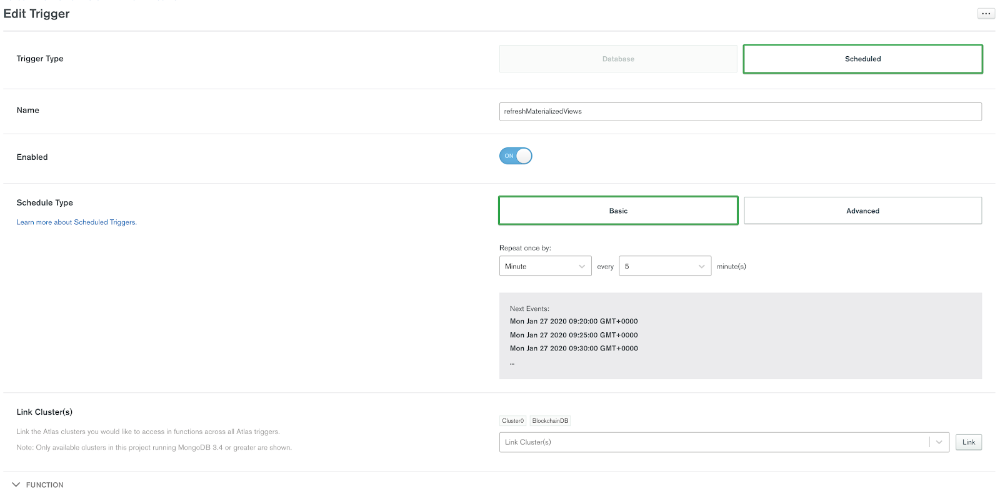

# Title - Spirits in the Materialized View: Automatic Refresh of Materialized Views

## When Views Started Being Materialized

[MongoDB 4.2](https://www.mongodb.com/blog/post/mongodb-42-is-now-ga-ready-for-your-production-apps) introduced a highly anticipated feature in the form of the [`$merge` stage](https://docs.mongodb.com/manual/reference/operator/aggregation/merge/index.html), which essentially allows users to incrementally persist their aggregation outputs (views) into a targeted collection. 
This ability allows users to perform their calculations and data transformations offline from their online work by creating those [Materialized Views](https://www.mongodb.com/blog/post/coming-in-mongodb-42--ondemand-materialized-views).

This is a compelling addition to the MongoDB feature-set suite and I'd like to make it even more powerful by adding one piece to this puzzle, namely the ability to easily auto-refresh Materialized Views. 

Now, this is where having your data on MongoDB Atlas and taking advantage of MongoDB's [Atlas Triggers](https://docs.atlas.mongodb.com/triggers/) comes in handy. 

<div class='callout'>

If you didn't set up your free cluster on MongoDB Atlas, now is a great time to do so. You have all the instructions in this [blog post](https://www.mongodb.com/blog/post/quick-start-getting-your-free-mongodb-atlas-cluster).

</div>


## Atlas Triggers

With [Scheduled Triggers](https://docs.atlas.mongodb.com/triggers/#scheduled-triggers) it is very easy to define the schedule of your choice either with the basic or advanced `cron` expression. 

To better explain my idea let's consider the following “zoo” management application as an example. As part of this application we need to provide our end users with 2 digested datasets:
- `budgets`: The current/historical budget spent on salaries.
- `quarterlyreport`: An up to date report on the purchases.

The pipelines to build those are taken from our documentation examples:
```
# reporting.budgets
db.getSiblingDB("zoo").salaries.aggregate( [
   { $match : { fiscal_year:  { $gte : 2019 } } },
   { $group: { _id: { fiscal_year: "$fiscal_year", dept: "$dept" }, salaries: { $sum: "$salary" } } },
   { $merge : { into: { db: "reporting", coll: "budgets" }, on: "_id",  whenMatched: "replace", whenNotMatched: "insert" } }
] )

# zoo.quarterlyreport
db.purchaseorders.aggregate( [
   { $group: { _id: "$quarter", purchased: { $sum: "$qty" } } },  // group purchase orders by quarter
   { $merge : { into: "quarterlyreport", on: "_id",  whenMatched: "merge", whenNotMatched: "insert" } }
])
```

To create those Auto Refreshing Materialized Views the trigger will run a function every 5 minutes which will cause the needed `$merge` commands to run.

Now the cool part is that the database/collections and the associated Materialized Views can be defined in a MongoDB collection, making the solution flexible and dynamic:

```
use configurations;
db.5_min_mviews.find()
{
     sourceDatabase: "zoo",
     sourceCollection: "salaries",
     pipeline : "[...]",
     targetCollection : "budgets"
} 
```

### Trigger code

Creating the trigger is extremely easy with an intuitive UI.


**Function Code**

```
 exports =  function() {
   // Log a trigger start time
  var currDate = new Date();
  console.log('Trigger refreshMaterializedViews started at ' +  currDate.toString() );

  
  // Query  all the needed materialized Views from the configuration collection
  const materializedViews =  context.services.get("Cluster0").db("configurations").collection("5_min_mviews");
  materializedViews.find().toArray().then( viewsList =>
  { 
    // Create an execution array of all the $merge commands
    var commandArray = [];
    viewsList.forEach(function(view){
    
        var collection = context.services.get("Cluster0").db(view.sourceDb).collection(view.sourceCollection);
        var pipeline = EJSON.parse(view.pipeline);
        commandArray.push(collection.aggregate(pipeline).toArray());
        console.log('Refreshed Materialized View: '+ view.targetCollection);
      });
  
  // Run all $merge in a promise to optimize their parallel run.
    Promise.all(commandArray).then(result => {
      currDate = new Date();
       console.log('Finished all refreshes at ' + currDate);
        }).catch( err => {
          console.error(err);
       });
  }).catch( err => {
          console.error(err)});
};

```

As a result, we have all the target collections refreshed according to the configured pipelines in the `configurations.5_min_mviews` collection.

The code grabs all the configurations from `configurations.5_min_mviews`  collection, and builds a _Promise.all_ execution statements to perform each pipeline queried. Once all statements are executed in parallel, we will endup with a refresh of the Materialized Views. 

Using this strategy, we can use a similar code and classify our `mviews` with different configurations consumed at different time intervals with a dedicated trigger. 

### Materialized Views Configuration & Run Results 

I’ve placed the needed pipelines inside the following configuration documents:
```
{
"sourceDb":"zoo",
"sourceCollection":"salaries",
"pipeline":"[    { \"$group\": { \"_id\": { \"fiscal_year\": \"$fiscal_year\", \"dept\": \"$dept\" }, 
            \"salaries\": { \"$sum\": \"$salary\" } } },    { \"$merge\" : { \"into\": { \"db\": \"reporting\", \"coll\": \"budgets\" },
             \"on\": \"_id\", 
             \"whenMatched\": \"replace\", 
            \"whenNotMatched\": \"insert\" } } ]",
 "targetCollection" : "budgets"
},
{
"sourceDb":"zoo",
"sourceCollection":"purcheseorders",
"pipeline":"[ { \"$group\": { "_id\": \"$quarter\", \"purchased\": { \"$sum\": \"$qty\" } } },  
             { \"$merge\" : { \"into\": \"quarterlyreport\", 
               \"on\": \"_id\", 
                \"whenMatched\": \"merge\", 
                \"whenNotMatched\" : \"insert\" } }]",
 "targetCollection" : "quarterlyreport"
}
```

This will result in 2 Materialized views :
- `reporting.budgets` - Which will be derived from the “zoo.salaries” collection and will have the yearly budget spent on salaries,
- `zoo.quarterlyreport` - Which will be derived from the “zoo.purcheseorders” collection and will have a quarterly purchase report.


Our trigger will sync those target collections each 5 min and logged output should be:
```
[
  "Trigger refreshMaterializedViews started at Thu, 30 Jan 2020 08:10:00 UTC",
  "Refreshed Materialized View: budgets",
  "Refreshed Materialized View: quarterlyreport",
  "Finished all refreshes at Thu, 30 Jan 2020 08:10:00 UTC"
]
```

Wow! That's it! All of our views are updated in parallel and will continue to do so every 5 min, and we can now start consuming them for our [BI tools or MongoDB Charts](http://mongodb.com/products/bi-connector).

Our applications can ingest new configurations to our `configurations.5_min_mviews` collection and the trigger will just automatically pick them up and execute.

## Wrapping Up

Atlas offers a [BI Connector](https://docs.mongodb.com/bi-connector/v2.1/tutorial/connecting-to-atlas/) and [Charts](https://docs.mongodb.com/charts/saas/) components to help you consume your digested materialized views and make instant values out of them. Closing this loop proves how MongoDB and Atlas makes data stunningly easy to work with.

I encourage you all to start triggering your data [today](https://www.mongodb.com/cloud/atlas).


